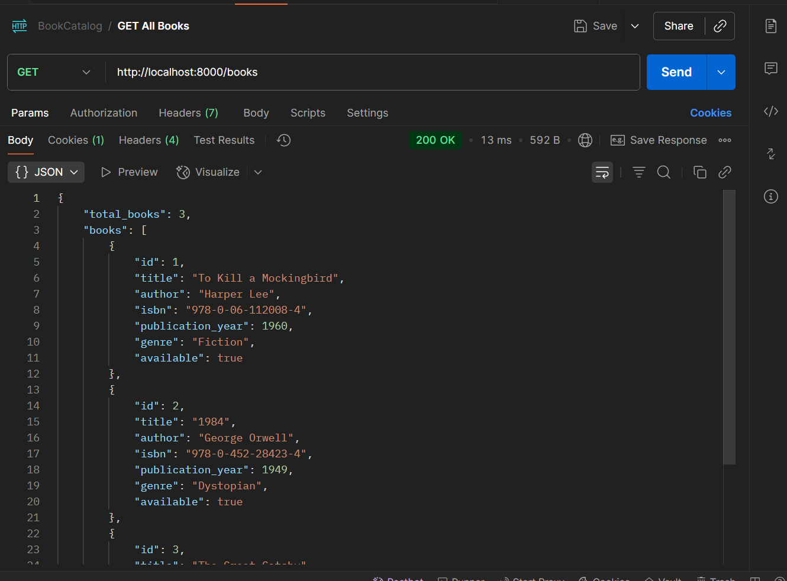
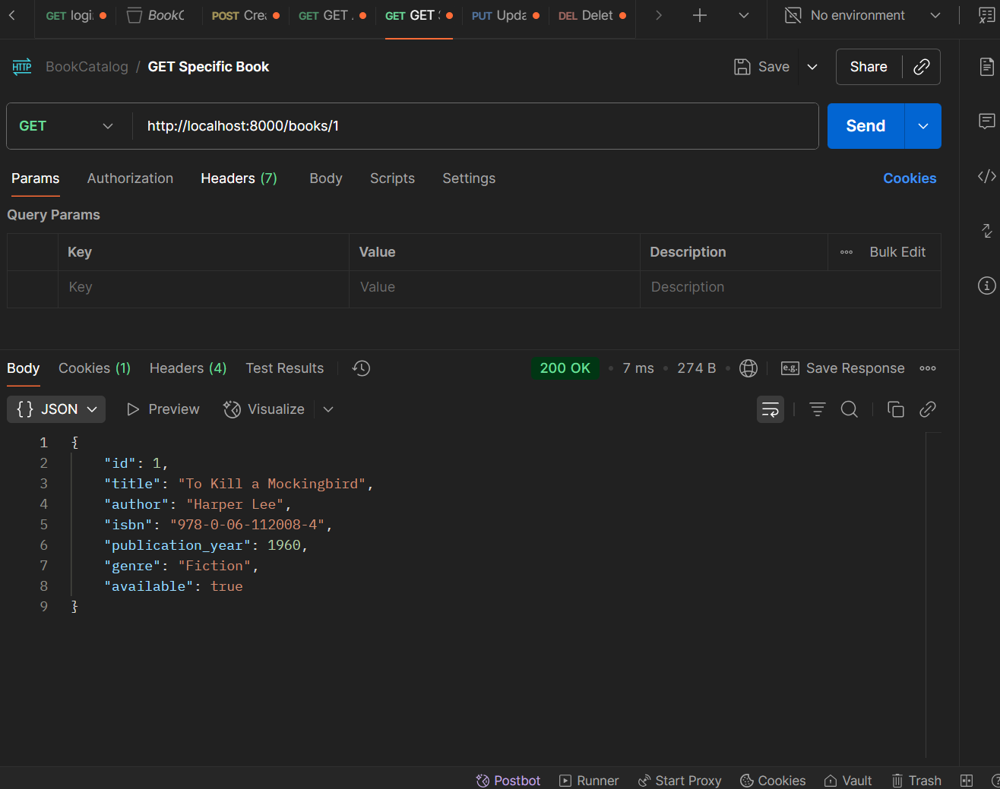
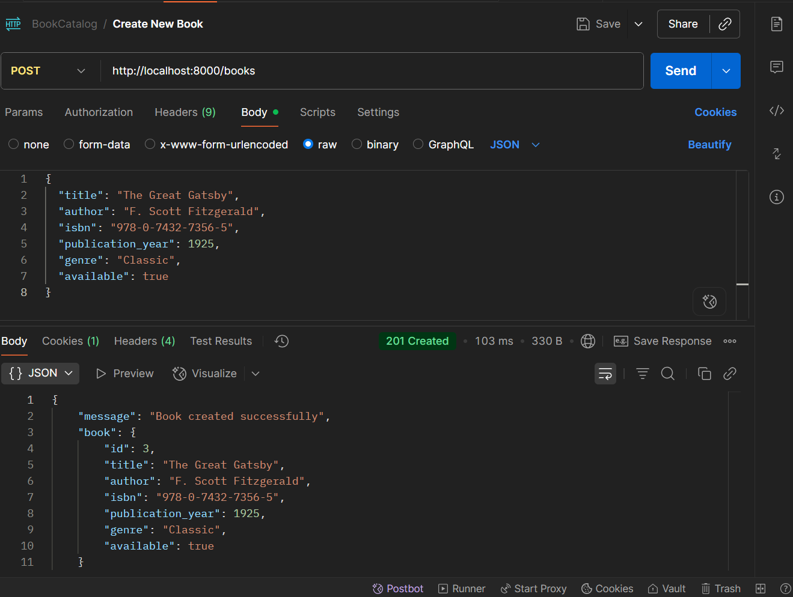
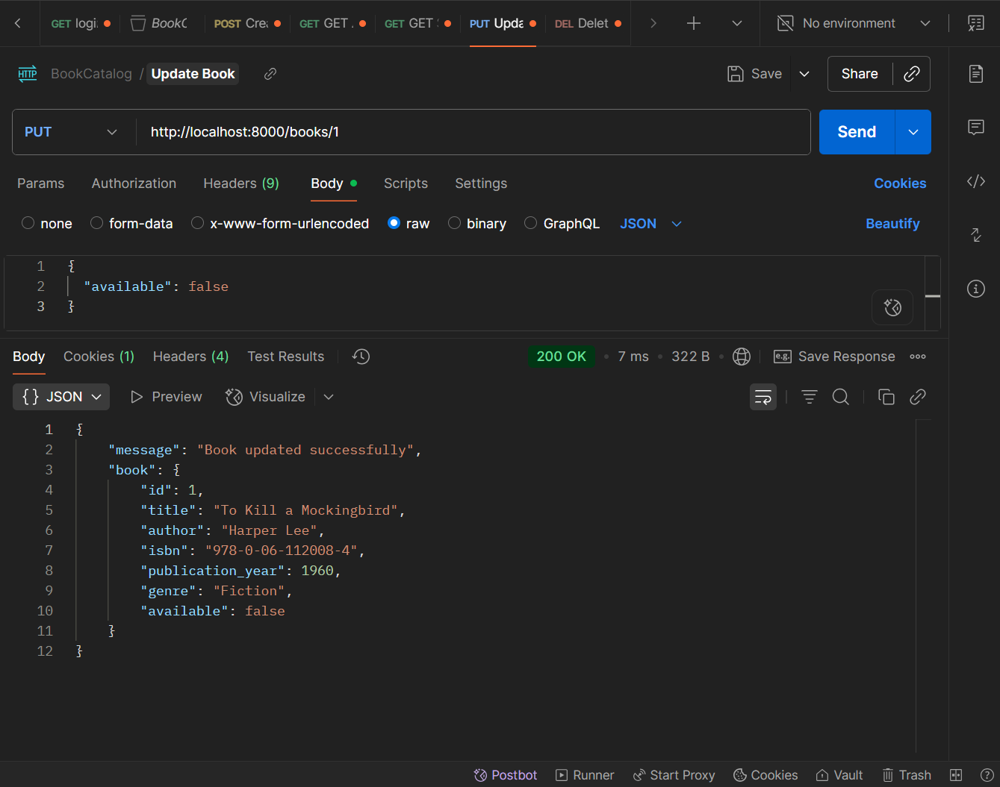
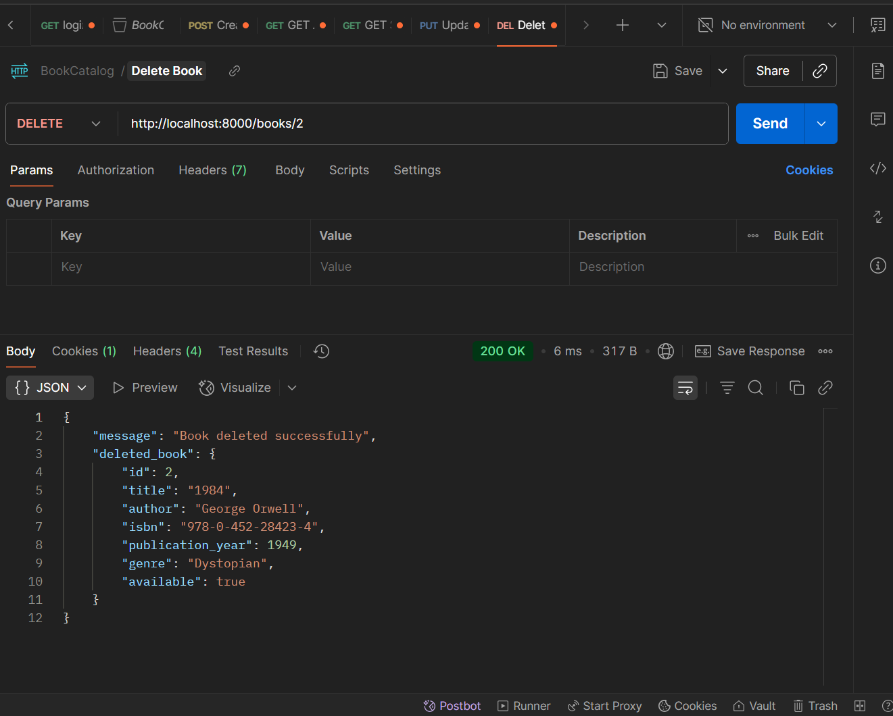

# Book Catalog API (Roll IMT2023106)

Simple REST API for a book catalog built with FastAPI. This project demonstrates basic CRUD operations using an in-memory dictionary as the data store.

## Overview
- Language: Python  
- Framework: FastAPI  
- Dev server: Uvicorn  
- Data store: in-memory dictionary (`books_db`) — data is lost when the server stops.

## How to run (Windows / PowerShell)
1. Create and activate virtual environment:
```powershell
python -m venv .venv
Set-ExecutionPolicy -ExecutionPolicy RemoteSigned -Scope Process -Force; .\.venv\Scripts\Activate.ps1
```
2. Install dependencies:
```powershell
pip install --upgrade pip
pip install fastapi uvicorn[standard]
```
3. Run the app (option A — recommended for development):
```powershell
uvicorn restapi_106:app --reload --host 0.0.0.0 --port 8000
```
Option B — run the script directly:
```powershell
python restapi_106.py
```

## Models
Book (required fields)
- title: string
- author: string
- isbn: string
- publication_year: integer
- genre: string
- available: boolean (default: true)

BookUpdate: same fields but all optional (used for partial updates)

## Endpoints

1. GET /
- Description: API root with a quick list of endpoints
- Response: welcome message and endpoints list

2. GET /books
- Description: Return all books; supports filtering
- Query parameters:
  - genre (optional) — filter by genre (case-insensitive)
  - available (optional, boolean) — filter by availability
- Response: JSON with total_books and books (each book includes its id)

Example:
```http
GET /books?genre=Fiction&available=true
```

Postman example (Get all books):



3. GET /books/{book_id}
- Description: Retrieve a single book by ID
- Path parameter: book_id (int)
- Responses:
  - 200: book object with id
  - 404: book not found

Postman example (Get specific book):



4. POST /books
- Description: Create a new book
- Body: Book (JSON)
- Responses:
  - 201: created book with assigned id
  - 400: ISBN already exists

Example request body:
```json
{
  "title": "New Book",
  "author": "Author Name",
  "isbn": "123-4567890123",
  "publication_year": 2024,
  "genre": "Non-Fiction",
  "available": true
}
```

Postman example (Create new book):



5. PUT /books/{book_id}
- Description: Update an existing book (partial updates allowed via BookUpdate)
- Path parameter: book_id (int)
- Body: BookUpdate (only include fields to change)
- Responses:
  - 200: updated book
  - 404: book not found
  - 400: attempted ISBN conflict with another book

Postman example (Update book):



6. DELETE /books/{book_id}
- Description: Delete a book by ID
- Responses:
  - 200: success with deleted book info
  - 404: book not found

Postman example (Delete book):



## Implementation notes / what I did
- Built a small FastAPI application that exposes CRUD endpoints for books.
- Used Pydantic models (Book and BookUpdate) for request validation and serialization.
- Used a module-level dictionary (`books_db`) to act as a simple in-memory database and a `next_book_id` counter to assign IDs.
- Implemented basic validation:
  - Prevent creating or updating a book to an ISBN that already exists in another record.
  - Return appropriate HTTP status codes and messages (400, 404, 201, 200).
- Added query filters (genre, available) to GET /books.
- Included inline documentation (docstrings) and a root endpoint listing available endpoints.
